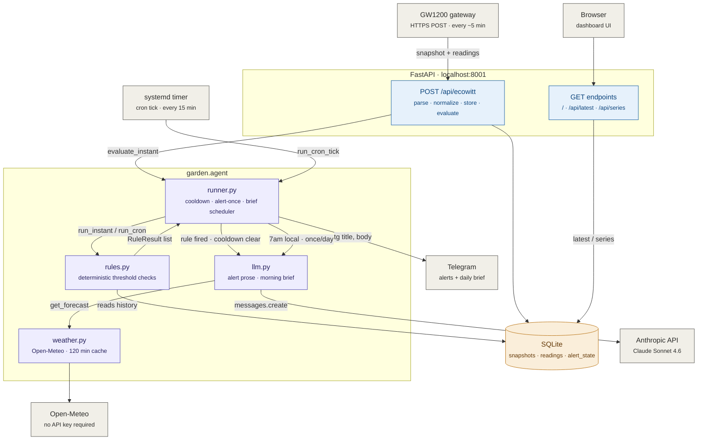

<p align="center">
  
</p>

# garden-agent

Self-hosted pipeline: ingests Ecowitt soil/air sensor data from a GW1200 gateway, stores it in SQLite, serves a dashboard at `your.domain.com`, and runs a deterministic-rules agent that calls Claude to write Telegram alerts and a daily morning brief.



## Requirements

- Python 3.11+
- [uv](https://docs.astral.sh/uv/getting-started/installation/)
- Ecowitt GW1200 gateway (or use `scripts/fake_post.sh` to simulate)

## Install

```bash
git clone <repo-url> garden-agent
cd garden-agent
uv sync
```

## Configure

```bash
cp secrets.env.example secrets.env
chmod 600 secrets.env
$EDITOR secrets.env
```

Required values in `secrets.env`:

| Key | Description |
|-----|-------------|
| `INGEST_PASSKEY` | Any random string; set the same value in the GW1200 custom-server config. `openssl rand -hex 16` works. |
| `TELEGRAM_BOT_TOKEN` | From @BotFather. See [docs/telegram.md](docs/telegram.md). |
| `TELEGRAM_CHAT_ID` | Your personal chat ID. See [docs/telegram.md](docs/telegram.md). |
| `ANTHROPIC_API_KEY` | From [console.anthropic.com](https://console.anthropic.com/settings/keys). Used for alert prose (Stage 8). |
| `DB_PATH` | SQLite file path. Default: `garden.sqlite3`. |

Sensor thresholds, cooldowns, and channel labels live in `config.yaml` — edit freely, no code changes needed.

## Run (local dev)

```bash
uv run uvicorn garden.main:app --reload
```

- Dashboard: http://127.0.0.1:8000
- Health: http://127.0.0.1:8000/health
- Ingest: `POST http://127.0.0.1:8000/api/ecowitt`

Simulate a sensor POST:

```bash
./scripts/fake_post.sh
```

Trigger low-moisture values (trips the alert rule):

```bash
LOW=1 ./scripts/fake_post.sh
```

Test Telegram delivery:

```bash
./scripts/tg_test.sh
```

## Deploy (GCP e2-micro + Cloudflare Tunnel)

```bash
# On the VM — replace YOUR_VM_USER with your username
git clone <repo-url> ~/apps/garden-agent
cd ~/apps/garden-agent
uv sync
cp secrets.env.example secrets.env && nano secrets.env && chmod 600 secrets.env

# Edit the service file, then install
sed -i 's/YOUR_VM_USER/'"$USER"'/g' systemd/garden-agent.service
sudo cp systemd/garden-agent.service /etc/systemd/system/
sudo systemctl daemon-reload
sudo systemctl enable --now garden-agent
curl -s localhost:8001/health
```

Cloudflare Tunnel (`your.domain.com` → `localhost:8001`):

```bash
# Install cloudflared
curl -L https://github.com/cloudflare/cloudflared/releases/latest/download/cloudflared-linux-amd64 \
  -o /tmp/cloudflared && sudo install /tmp/cloudflared /usr/local/bin/cloudflared

# Authenticate + create tunnel
cloudflared tunnel login
cloudflared tunnel create garden
cloudflared tunnel route dns garden your.domain.com

# Write ~/.cloudflared/config.yml:
#   tunnel: <TUNNEL_ID>
#   credentials-file: /home/<user>/.cloudflared/<TUNNEL_ID>.json
#   ingress:
#     - hostname: your.domain.com
#       service: http://localhost:8001
#     - service: http_status:404

sudo cloudflared service install
sudo systemctl enable --now cloudflared

# Verify
curl https://your.domain.com/health
```

Cron tick (watchdog + heartbeat, every 15 min):

```bash
sed -i 's/YOUR_VM_USER/'"$USER"'/g' systemd/garden-cron.service
sudo cp systemd/garden-cron.{service,timer} /etc/systemd/system/
sudo systemctl daemon-reload
sudo systemctl enable --now garden-cron.timer
```

Nightly DB backup (02:00 UTC, keeps last 7 days):

```bash
sed -i 's/YOUR_VM_USER/'"$USER"'/g' systemd/garden-backup.service
sudo cp systemd/garden-backup.{service,timer} /etc/systemd/system/
sudo systemctl daemon-reload
sudo systemctl enable --now garden-backup.timer
```

Journal log rotation (cap at 200MB):

```bash
sudo mkdir -p /etc/systemd/journald.conf.d
sudo cp systemd/journald-garden.conf /etc/systemd/journald.conf.d/garden.conf
sudo systemctl restart systemd-journald
```

## Hardware (GW1200 config)

In the GW1200 web UI or WSView app → **Customized Server**:

| Field | Value |
|-------|-------|
| Protocol | Ecowitt |
| Server IP / Hostname | `your.domain.com` |
| Path | `/api/ecowitt` |
| Port | `443` |
| Upload interval | `60` s |
| PASSKEY | matches `INGEST_PASSKEY` in `secrets.env` |

## API

| Method | Path | Description |
|--------|------|-------------|
| `GET` | `/` | Dashboard |
| `GET` | `/health` | `{status, sensors_seen, last_reading_ts}` |
| `POST` | `/api/ecowitt` | Ecowitt-protocol ingest |
| `GET` | `/api/latest` | Latest value per sensor (JSON array) |
| `GET` | `/api/series?sensor=soilmoisture1&hours=24` | Time-series for one sensor |
