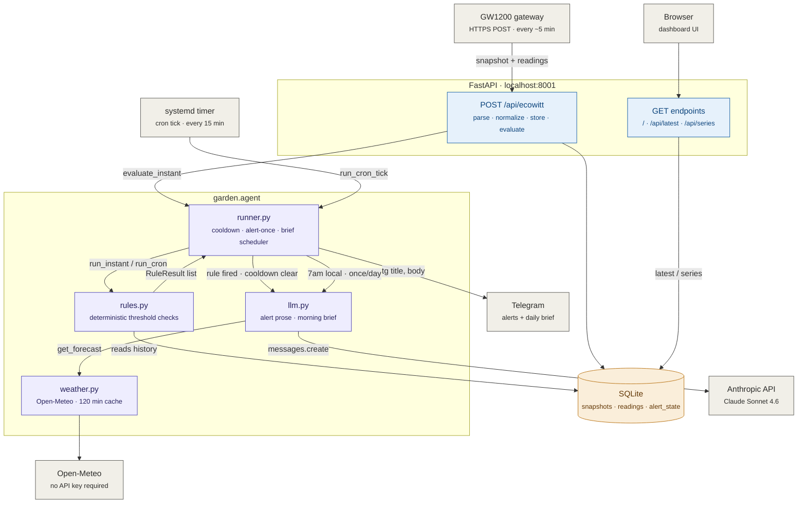
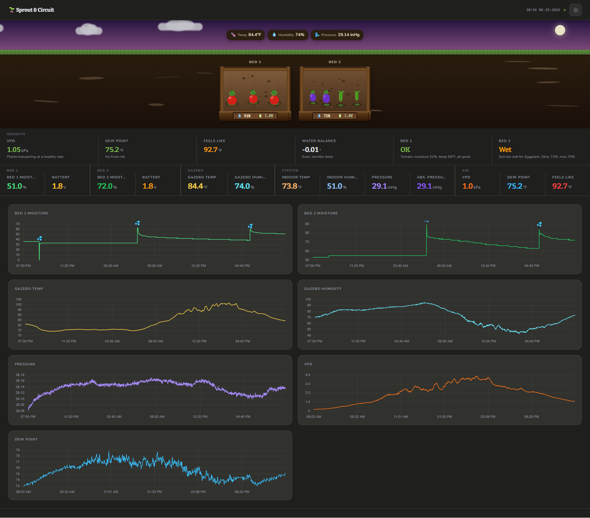

<p align="center">
  
</p>

# garden-agent

Self-hosted pipeline: ingests Ecowitt soil/air sensor data from a GW1200 gateway, stores it in SQLite, serves a dashboard at `your.domain.com`, and runs a deterministic-rules agent that calls Claude to write Telegram alerts and a daily morning brief.



## Screenshots

<details>
<summary>Light mode</summary>


</details>

<details>
<summary>Night mode</summary>



</details>

## Requirements

- Python 3.11+
- [uv](https://docs.astral.sh/uv/getting-started/installation/)
- Ecowitt GW1200 gateway (or use `scripts/fake_post.sh` to simulate)

## Install

```bash
git clone <repo-url> garden-agent
cd garden-agent
uv sync
```

## Configure

```bash
cp secrets.env.example secrets.env
chmod 600 secrets.env
$EDITOR secrets.env
```

Required values in `secrets.env`:

| Key | Description |
|-----|-------------|
| `INGEST_PASSKEY` | Any random string; set the same value in the GW1200 custom-server config. `openssl rand -hex 16` works. |
| `TELEGRAM_BOT_TOKEN` | From @BotFather. See [docs/telegram.md](docs/telegram.md). |
| `TELEGRAM_CHAT_ID` | Your personal chat ID. See [docs/telegram.md](docs/telegram.md). |
| `ANTHROPIC_API_KEY` | From [console.anthropic.com](https://console.anthropic.com/settings/keys). Used for alert prose (Stage 8). |
| `DB_PATH` | SQLite file path. Default: `garden.sqlite3`. |

Sensor thresholds, cooldowns, and channel labels live in `config.yaml` — edit freely, no code changes needed.

## Run (local dev)

```bash
uv run uvicorn garden.main:app --reload
```

- Dashboard: http://127.0.0.1:8000
- Health: http://127.0.0.1:8000/health
- Ingest: `POST http://127.0.0.1:8000/api/ecowitt`

Simulate a sensor POST:

```bash
./scripts/fake_post.sh
```

Trigger low-moisture values (trips the alert rule):

```bash
LOW=1 ./scripts/fake_post.sh
```

Test Telegram delivery:

```bash
./scripts/tg_test.sh
```

## Deploy (GCP e2-micro + Cloudflare Tunnel)

```bash
# On the VM — replace YOUR_VM_USER with your username
git clone <repo-url> ~/apps/garden-agent
cd ~/apps/garden-agent
uv sync
cp secrets.env.example secrets.env && nano secrets.env && chmod 600 secrets.env

# Edit the service file, then install
sed -i 's/YOUR_VM_USER/'"$USER"'/g' systemd/garden-agent.service
sudo cp systemd/garden-agent.service /etc/systemd/system/
sudo systemctl daemon-reload
sudo systemctl enable --now garden-agent
curl -s localhost:8001/health
```

Cloudflare Tunnel (`your.domain.com` → `localhost:8001`):

```bash
# Install cloudflared
curl -L https://github.com/cloudflare/cloudflared/releases/latest/download/cloudflared-linux-amd64 \
  -o /tmp/cloudflared && sudo install /tmp/cloudflared /usr/local/bin/cloudflared

# Authenticate + create tunnel
cloudflared tunnel login
cloudflared tunnel create garden
cloudflared tunnel route dns garden your.domain.com

# Write ~/.cloudflared/config.yml:
#   tunnel: <TUNNEL_ID>
#   credentials-file: /home/<user>/.cloudflared/<TUNNEL_ID>.json
#   ingress:
#     - hostname: your.domain.com
#       service: http://localhost:8001
#     - service: http_status:404

sudo cloudflared service install
sudo systemctl enable --now cloudflared

# Verify
curl https://your.domain.com/health
```

Cron tick (watchdog + heartbeat, every 15 min):

```bash
sed -i 's/YOUR_VM_USER/'"$USER"'/g' systemd/garden-cron.service
sudo cp systemd/garden-cron.{service,timer} /etc/systemd/system/
sudo systemctl daemon-reload
sudo systemctl enable --now garden-cron.timer
```

Nightly DB backup (02:00 UTC, keeps last 7 days locally + pushes to Cloudflare R2):

```bash
sed -i 's/YOUR_VM_USER/'"$USER"'/g' systemd/garden-backup.service
sudo cp systemd/garden-backup.{service,timer} /etc/systemd/system/
sudo systemctl daemon-reload
sudo systemctl enable --now garden-backup.timer
```

R2 offsite backup is optional — add these to `secrets.env` to enable (see [docs/deploy.md](docs/deploy.md) for setup):

| Key | Description |
|-----|-------------|
| `R2_ACCOUNT_ID` | Cloudflare account ID (R2 overview sidebar) |
| `R2_BUCKET` | Bucket name, e.g. `garden-backups` |
| `R2_ACCESS_KEY_ID` | From R2 → Manage API Tokens |
| `R2_SECRET_ACCESS_KEY` | From R2 → Manage API Tokens |

Also install rclone once: `curl https://rclone.org/install.sh | sudo bash`

Restore from R2 onto a fresh VM: `bash scripts/restore_db.sh`

Journal log rotation (cap at 200MB):

```bash
sudo mkdir -p /etc/systemd/journald.conf.d
sudo cp systemd/journald-garden.conf /etc/systemd/journald.conf.d/garden.conf
sudo systemctl restart systemd-journald
```

## Hardware Setup

Tested with: **GW1200** gateway + **WH51** soil moisture sensors + **WN31** multi-channel temp/humidity sensor. Other Ecowitt sensors that use the same HTTP push protocol will also work — add their fields to `_FIELD_MAP` in `garden/ingest.py`.

### What each device sends

| Device | Fields |
|--------|--------|
| GW1200 (built-in) | `tempinf`, `humidityin`, `baromrelin`, `baromabsin` |
| WH51 (per channel) | `soilmoisture1`…`soilmoisture8`, `soilbatt1`…`soilbatt8` |
| WN31 (per channel) | `temp1f`…`temp8f`, `humidity1`…`humidity8` |

### Step 1 — Connect the GW1200 to WiFi

Download **WSView Plus** (iOS / Android — not the older "WSView"). Open it → **+** → **Add Device** → **GW1200**. Follow the in-app steps to connect the gateway to your **2.4 GHz** WiFi. Once connected, the LED goes solid and the app shows the device with its local IP.

### Step 2 — Pair WH51 soil sensors

Do one at a time so you know which channel maps to which location.

1. WSView Plus → tap your GW1200 → **Sensor List** → **+**.
2. Hold the button on the WH51 until its LED flashes rapidly (~5 s) to enter pairing mode.
3. The app assigns the next available channel (ch1, ch2, …). Rename it immediately (e.g. "Bed 1").
4. Repeat for additional sensors.
5. Push probes into soil at ~45°, mostly buried, leaving the transmitter above ground (~4–6 inch depth).

Channel → storage key: ch1 → `soilmoisture1` / `soilbatt1`, ch2 → `soilmoisture2` / `soilbatt2`, etc.

### Step 3 — Set WN31 dip switches and pair

The WN31 has 3 dip switches on the back that set which channel (1–8) it broadcasts on. Set them before inserting batteries.

| Channel | SW1 | SW2 | SW3 |
|---------|-----|-----|-----|
| 1 | OFF | OFF | OFF |
| 2 | ON  | OFF | OFF |
| 3 | OFF | ON  | OFF |
| 4 | ON  | ON  | OFF |

Set to channel 1 (all OFF) → reports as `temp1f` / `humidity1`. Pair via WSView Plus the same way as WH51. **Note:** the WN31 is not rated for outdoor use — place it in a greenhouse, shed, or indoors.

### Step 4 — Point the GW1200 at your server

In **WSView Plus**: tap your GW1200 → gear icon → **Customized Server**. Fill in:

| Field | Value |
|-------|-------|
| Protocol | **Ecowitt** (not Wunderground) |
| Server IP / Hostname | `your.domain.com` |
| Path | `/api/ecowitt` |
| Port | `443` |
| Upload Interval | `60` seconds |
| PASSKEY | value of `INGEST_PASSKEY` from `secrets.env` |

Alternatively, use the GW1200's local web UI: `http://<gateway-local-IP>` → **Weather Services** → **Customized**.

### Step 5 — Verify

Wait 60–90 s, then:

```bash
curl https://your.domain.com/health
# "sensors_seen" should be > 0 and "last_reading_ts" a real timestamp
```

Check logs if nothing arrives:

```bash
sudo journalctl -u garden-agent -n 30
# Look for: "Parsed snapshot ts=..., N metrics"
# 401 means PASSKEY mismatch; 400 means unrecognised payload
```

### Wipe test data before going live

```bash
sudo systemctl stop garden-agent
rm ~/apps/garden-agent/garden.sqlite3   # schema auto-recreates on next start
sudo systemctl start garden-agent
```

Full step-by-step setup guide (including troubleshooting): [docs/hardware-setup.md](docs/hardware-setup.md)

## API

| Method | Path | Description |
|--------|------|-------------|
| `GET` | `/` | Dashboard |
| `GET` | `/health` | `{status, sensors_seen, last_reading_ts}` |
| `POST` | `/api/ecowitt` | Ecowitt-protocol ingest |
| `GET` | `/api/latest` | Latest value per sensor (JSON array) |
| `GET` | `/api/series?sensor=soilmoisture1&hours=24` | Time-series for one sensor |
